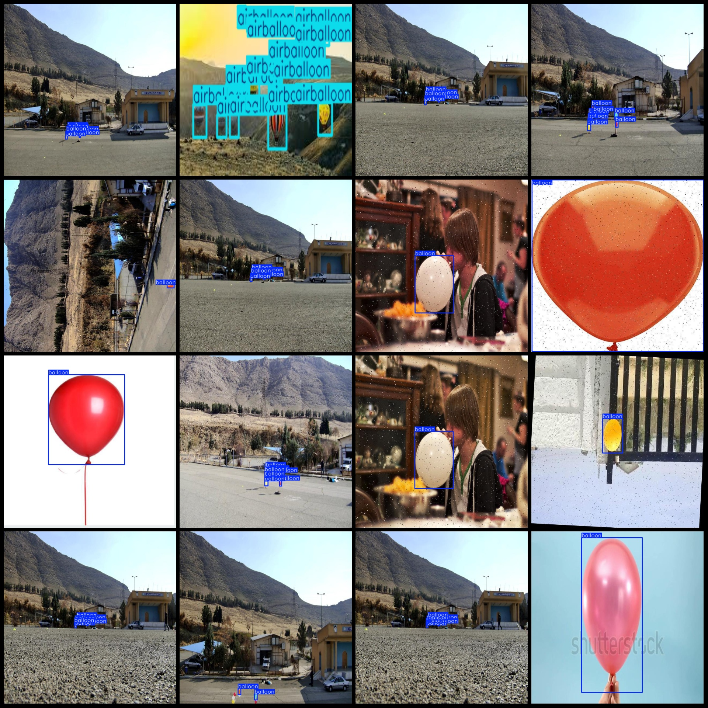
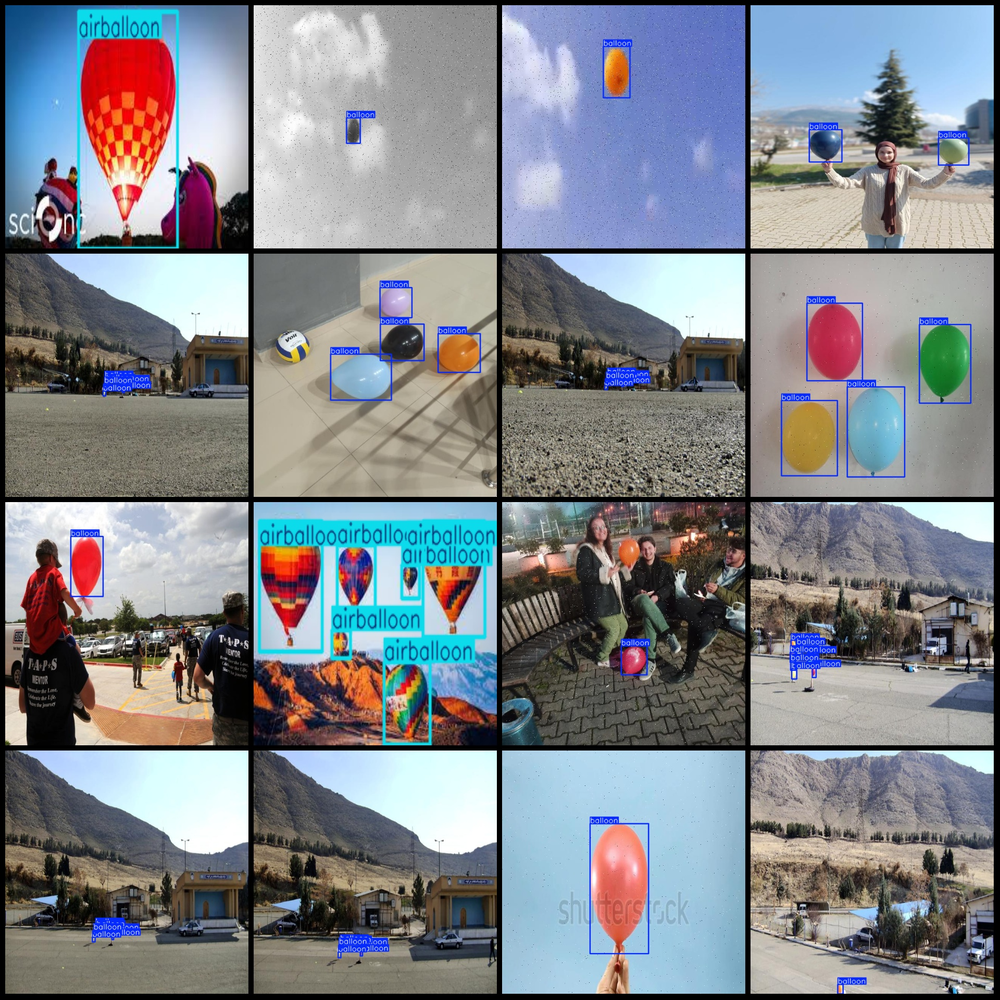

# Balloon and Air Balloon Detection Dataset (VOC+YOLO)

This dataset format includes Pascal VOC and YOLO files, with no split path included in the txt file. It consists of 1899 images in JPG format, along with corresponding VOC format XML files and YOLO format txt files.

**Image Count (JPG Files):** 1899
**Annotation Count (XML Files):** 1899
**Annotation Count (Txt Files):** 1899
**Number of Annotation Categories:** 2
**Annotation Category Names (Note that the order of categories in the YOLO format does not match this, but is based on the classes.txt file in the labels folder):** ["airballoon", "balloon"]

Each category has a specified number of bounding boxes:
- airballoon (hot balloon) = 266
- balloon (balloon) = 5817

Total bounding box count = 6083
Image resolution = 640x640
Dataset enhancement includes rotation, mainly.
Annotation tool used: labelImg
Annotation rules are to draw bounding boxes for each class.

Important Notes: No further specific instructions provided.
Special Notice: This dataset does not guarantee the accuracy of models trained or weights files.

**Annotation Example:**

## Images

Here is a pay link on Stripe ( https://buy.stripe.com/3cs8yP7sY87d0vu9AB ). Please contact me lonlonago@foxmail.com after funding $89, and I will send you a complete data files , thank you!

